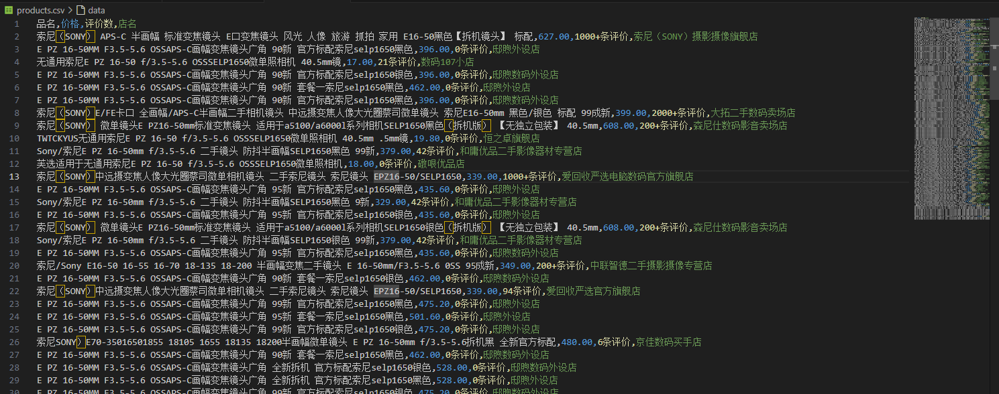
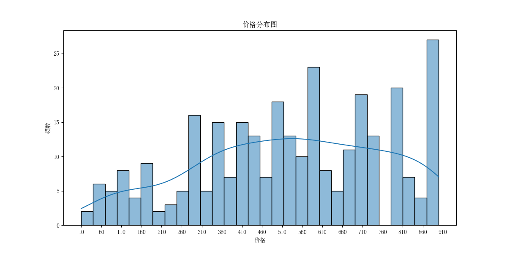
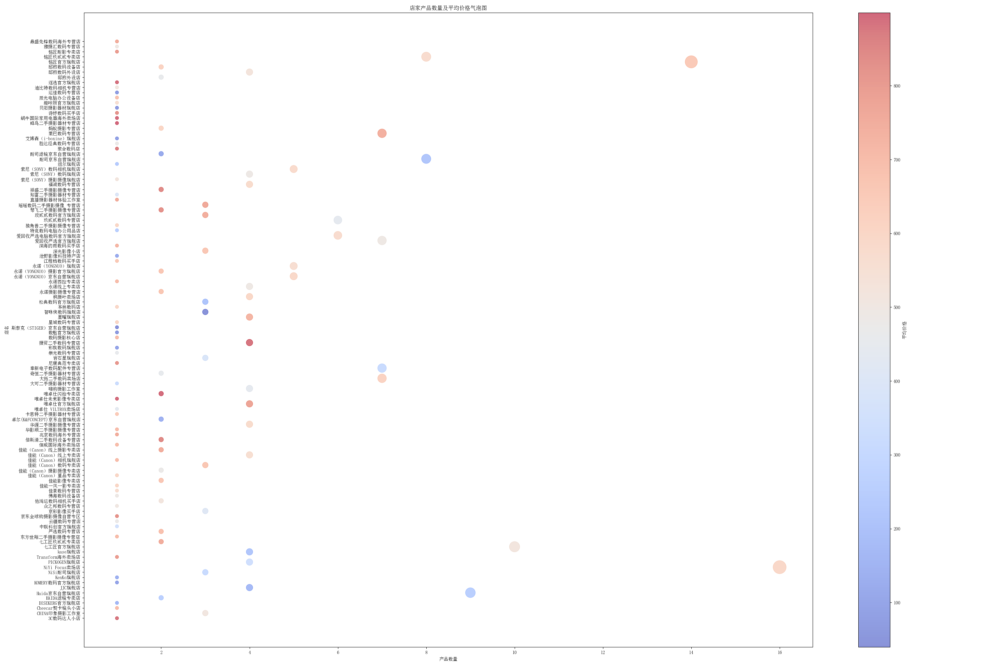

# JD 商品爬取与分析

## 郑重声明

**本工程不会以任何形式获取你的账号或密码，你填入的账号及密码仅用于本地调试自动输入，你可以将其删除！**

## 项目概述

该项目旨在通过爬取京东网站上的商品信息，并对其进行分析和可视化。项目基于 Selenium 和 BeautifulSoup 开发，适用于本地部署。

## 环境要求

- Python 3.7 及以上版本
  - 编写时使用的是Python 3.13.0 64-bit，过低的版本可能会导致不可预料的问题，建议至少使用Python 3.8
- 安装必要的库（见下文）
- Microsoft Edge 浏览器及对应的 `msedgedriver.exe`（或其他浏览器及其调试工具）

## 安装依赖库

你可以使用以下命令一键安装所有所需的 Python 库：

```bash
pip install selenium beautifulsoup4 pandas matplotlib seaborn
```

## 注意事项

- 该工程仅部署在本地，请确保所有文件在同一目录下。
- `msedgedriver.exe` 是专门为 Microsoft Edge 设计的驱动程序，如果你使用其他浏览器（如 Google Chrome），请下载相应的驱动程序并修改代码中的路径。
- 登录京东账号时需要手动完成滑动验证码，具体步骤将在控制台提示。
- **重要**: 请手动更改 `download.py` 中的账号和密码，以避免泄露个人信息。
- **重要**: 在登录过程中，会遇到滑动验证码，请手动完成。

## 工程文件介绍

- `/htmls/`: 用于存储 `download.py` 产生的 HTML 文件。
- `/imgs/`: 用于存储 `README.md` 中使用的图片。
- `analysis.py`: 用于分析存储在 `/htmls/` 目录中的 HTML 文件，并生成 CSV 文件。
- `bubble_chart.png`: `pic.py` 分析产生的气泡图。
- `download.py`: 用于爬取 HTML 文件。
- `main.py` (可选): 用于一键执行整个流程（注意：可能存在小 bug）。
- `msedgedriver.exe`: 浏览器调试器（适用于 Microsoft Edge）。
- `pic.py`: 分析 CSV 文件，生成可视化图形。
- `price_distribution.png`: `pic.py` 分析产生的价格分布柱形图。
- `products.csv`: `analysis.py` 产生的 CSV 文件。
- `README.md`: 项目说明文档。

## 推荐运行顺序

如果不使用 `main.py`，推荐按以下顺序运行脚本：

1. `download.py`
2. `analysis.py`
3. `pic.py` （可选）

## 脚本详细说明

### download.py

该脚本用于从京东网站爬取指定关键词的商品页面，并保存为 HTML 文件。

### analysis.py

该脚本用于分析存储在 `/htmls/` 目录中的 HTML 文件，并从中提取商品信息（品名、价格、评价数、店名），最终生成 `products.csv` 文件。

#### 生成的 CSV 文件



### pic.py

该脚本用于分析 `products.csv` 文件，生成价格分布图 (`price_distribution.png`) 和气泡图 (`bubble_chart.png`)。

#### 价格分布图



#### 店家产品数量及平均价格气泡图



### main.py

该脚本用于一键执行上述三个脚本。请注意，该脚本可能存在小 bug，建议单独运行各个脚本以确保顺利进行。

## 联系方式

本人不经常看 GitHub，如有任何问题或建议，请尽可能发送邮件至 `lufh5746@163.com`。如果解决了问题，也可以将改进后的代码发给我，我会非常感谢！

## 致谢

感谢你使用我的项目！希望它能帮助你顺利完成任务。

## 许可证

本项目采用 [MIT 许可证](LICENSE)。

```txt
MIT License

Copyright (c) 2024 FH. Lu

Permission is hereby granted, free of charge, to any person obtaining a copy
of this software and associated documentation files (the "Software"), to deal
in the Software without restriction, including without limitation the rights
to use, copy, modify, merge, publish, distribute, sublicense, and/or sell
copies of the Software, and to permit persons to whom the Software is
furnished to do so, subject to the following conditions:

1. The above copyright notice and this permission notice shall be included in all
   copies or substantial portions of the Software.

2. Any modifications made to the Software must include a reference to the original
   source and author.

THE SOFTWARE IS PROVIDED "AS IS", WITHOUT WARRANTY OF ANY KIND, EXPRESS OR
IMPLIED, INCLUDING BUT NOT LIMITED TO THE WARRANTIES OF MERCHANTABILITY,
FITNESS FOR A PARTICULAR PURPOSE AND NONINFRINGEMENT. IN NO EVENT SHALL THE
AUTHORS OR COPYRIGHT HOLDERS BE LIABLE FOR ANY CLAIM, DAMAGES OR OTHER
LIABILITY, WHETHER IN AN ACTION OF CONTRACT, TORT OR OTHERWISE, ARISING FROM,
OUT OF OR IN CONNECTION WITH THE SOFTWARE OR THE USE OR OTHER DEALINGS IN THE
SOFTWARE.
```
